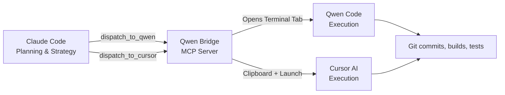

# Task: Create GitHub Repository for Qwen Bridge & Write Polished README

## Objective
Publish the **qwen-bridge** project to GitHub with a professional, polished English README that attracts international developers.

## Context
This project is a local MCP Server that bridges Claude Code to external coding agents (Qwen Code, Cursor). Claude does the planning, then dispatches task files to other coding tools for execution — saving Claude tokens.

You are Qwen Code, acting as the **executor**. Claude already planned everything; you just execute.

---

## Step 1: Initialize Git Repository

```bash
cd D:\qwen-bridge
git init
```

## Step 2: Create `.gitignore`

Create a `.gitignore` file with this content:

```
node_modules/
dist/
*.log
.env
```

## Step 3: Write the Polished README.md

Overwrite the existing `README.md` with the content below. Make it in **English**, visually appealing with badges, and structured for an international audience.

The README should be:

```markdown
# Qwen Bridge

> Seamlessly connect Claude Code to external coding agents. Plan with Claude, execute with Qwen Code or Cursor — save tokens, ship faster.

[](https://modelcontextprotocol.io)
[](https://www.typescriptlang.org)
[](https://nodejs.org)
[](LICENSE)

---

## What is Qwen Bridge?

Qwen Bridge is an **MCP (Model Context Protocol) Server** that runs locally and gives Claude Code two new superpowers:

| Tool | What it does |
|------|-------------|
| `dispatch_to_qwen` | Writes a task file, opens a Windows Terminal tab running Qwen Code, and sends you a notification — Claude returns immediately |
| `dispatch_to_cursor` | Copies the task to your clipboard, launches Cursor in the project folder, and shows the task in a terminal banner |
| `qwen_bridge_status` | Shows the bridge is alive and prints current config |

**The workflow**: Claude plans the architecture, writes detailed task files (`QWEN_*.md` / `CURSOR_*.md`), then dispatches them. Qwen Code or Cursor picks up the task and executes independently — **Claude tokens stay free for planning**.



## Why This Exists

Claude Code is great at **planning** — architecture decisions, code review, debugging strategies. But large implementations burn tokens fast. Qwen Code and Cursor have their own token pools. This bridge lets you:

1. **Plan once in Claude** (cheap, strategic)
2. **Execute in Qwen/Cursor** (uses their tokens)
3. **Never copy-paste manually** — the bridge handles dispatch, notifications, clipboard, and terminal launching

## Installation

```bash
git clone https://github.com/zhewenzhang/qwen-bridge.git
cd qwen-bridge
npm install
npm run build
```

## Configuration

Edit `config.json`:

```json
{
  "projectDir": "D:\\your-project",
  "qwenCommand": "qwen",
  "cursorCommand": "cursor",
  "terminalApp": "wt.exe",
  "notifyOnDispatch": true,
  "speechOnDispatch": true,
  "speechText": "Task dispatched"
}
```

| Field | Description |
|-------|------------|
| `projectDir` | Where your project lives — task file paths are relative to this |
| `qwenCommand` | CLI command to launch Qwen Code |
| `cursorCommand` | CLI command to launch Cursor |
| `terminalApp` | Terminal emulator (Windows Terminal by default) |
| `notifyOnDispatch` | Show a Windows toast notification when a task is dispatched |
| `speechOnDispatch` | Read a voice alert when a task is dispatched |
| `speechText` | The phrase spoken aloud |

## Register with Claude Code

Add this to your Claude Code settings (`~/.claude/settings.json` or project `.claude/settings.json`):

```json
{
  "mcpServers": {
    "qwen-bridge": {
      "command": "node",
      "args": ["D:\\qwen-bridge\\dist\\index.js"],
      "env": {}
    }
  }
}
```

Restart Claude Code, and the bridge tools become available automatically.

## Usage

### 1. Dispatch to Qwen Code

Ask Claude to write a task file, then:

```
Claude: Write a task file QWEN_FEATURE_AUTH.md with full implementation details
Claude: Then call dispatch_to_qwen("QWEN_FEATURE_AUTH.md", "Implement OAuth login flow")
```

What happens:
- Windows notification pops up: *"Qwen Bridge — Implement OAuth login flow"*
- Voice says: *"Qwen task dispatched"*
- A new Windows Terminal tab opens, `cd`s into your project, and starts Qwen Code
- Claude is **free** — continue planning the next task while Qwen works

### 2. Dispatch to Cursor

```
Claude: Write a task file CURSOR_REFACTOR.md and call dispatch_to_cursor("CURSOR_REFACTOR.md", "Refactor database layer")
```

What happens:
- Task content is **copied to your clipboard**
- Cursor opens in your project directory
- A terminal banner shows the task details and instructions: *"Open Cursor AI chat (Ctrl+Shift+J), press Ctrl+V, done"*
- Windows notification + voice alert fire

### 3. Check Bridge Status

```
Claude: Check if the bridge is running
```

Claude calls `qwen_bridge_status` and reports back the config and available tools.

## How the Dispatch Works (Under the Hood)

```
1. Claude calls dispatch_to_qwen("QWEN_task.md")
        │
2. Bridge validates the file exists
        │
3. Sends Windows toast notification + speech alert
        │
4. Spawns: wt.exe -w 0 new-tab --title "Qwen: task" powershell -NoExit -Command "..."
        │
5. Terminal opens → cd projectDir → show banner → launch qwen
        │
6. Bridge returns "✅ Dispatched" to Claude immediately
        │
7. Claude is free. Qwen Code runs independently.
```

## Project Structure

```
qwen-bridge/
├── src/
│   └── index.ts          # MCP Server main program
├── dist/
│   └── index.js          # Compiled output
├── config.json           # Your configuration
├── package.json
├── tsconfig.json
└── README.md
```

## Tech Stack

- **Runtime**: Node.js 20+
- **Language**: TypeScript 5.x (compiled to ESM)
- **Protocol**: [Model Context Protocol (MCP)](https://modelcontextprotocol.io)
- **Platform**: Windows (Windows Terminal, PowerShell)
- **Notifications**: Native Windows Toast + System.Speech TTS

## Development

```bash
# Install dependencies
npm install

# Build
npm run build

# Run locally (for testing)
npm run dev

# The MCP server communicates over stdio — test it manually:
echo '{"jsonrpc":"2.0","method":"tools/list","id":1}' | node dist/index.js
```

## Author

Created by [@zhewenzhang](https://github.com/zhewenzhang)

## License

MIT
```

**IMPORTANT**: Make sure to replace the README content exactly as shown above. The badges are important for a polished look. The mermaid diagram should render on GitHub.

## Step 4: Stage and Commit

```bash
cd D:\qwen-bridge
git add .
git commit -m "Initial commit: Qwen Bridge — MCP server bridging Claude Code to Qwen Code and Cursor"
```

## Step 5: Create GitHub Repository and Push

```bash
cd D:\qwen-bridge
gh repo create qwen-bridge --public --source=. --remote=origin --push --description "Seamlessly connect Claude Code to Qwen Code & Cursor. Plan with Claude, execute elsewhere — save tokens, ship faster."
```

If the repo already exists on GitHub, use:

```bash
cd D:\qwen-bridge
git remote add origin https://github.com/zhewenzhang/qwen-bridge.git
git branch -M main
git push -u origin main
```

## Step 6: Verify

After pushing, verify by running:

```bash
gh repo view zhewenzhang/qwen-bridge --web
```

This should open the GitHub repo in your browser with the polished README rendered.

---

## Completion Checklist

- [x] Git repo initialized
- [x] `.gitignore` created
- [x] Polished English README.md written with badges, mermaid diagram, and full docs
- [x] Code committed
- [x] GitHub repo created and code pushed
- [x] Browser opens to verify the repo looks good
