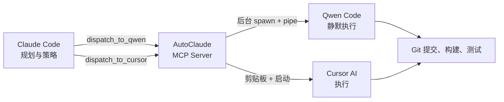

# Task: Token Cost Tracking + Chinese README + Updated Landing Page

## Context
AutoClaude saves massive Claude tokens by offloading execution to Qwen Code. We need to quantify this savings — show users exactly how many Claude tokens they saved and how much money that represents.

## Claude API Pricing (April 2026)
- **Claude Opus 4.7**: $5.00/1M input, $25.00/1M output
- **Claude Opus 4.5 (old pricing)**: $15.00/1M input, $75.00/1M output

We'll use Opus 4.7 pricing for current estimates.

---

## Phase 1: Update Git Remote and All URLs

### 1a. Update all references from `qwen-bridge` to `AutoClaude`

In ALL files (README.md, index.html, config.json, src/index.ts, package.json), ensure:
- GitHub URLs: `zhewenzhang/qwen-bridge` → `zhewenzhang/AutoClaude`
- Pages URL: `zhewenzhang.github.io/qwen-bridge` → `zhewenzhang.github.io/AutoClaude`

Run a comprehensive find-replace across all files.

### 1b. Update `.claude/settings.local.json`

If it exists, update the MCP server name and path references.

---

## Phase 2: Add Token Cost Tracking to `src/index.ts`

### 2a. Add cost constants and savings tracker

Add after the CONFIG_PATH constant:

```typescript
// ─── Token Economics ─────────────────────────────────────────────────────────
const CLAUDE_PRICING = {
  opus4_7: { input: 5.00, output: 25.00 },  // per 1M tokens
  opus4_5: { input: 15.00, output: 75.00 },  // legacy pricing for comparison
};

interface TaskSavings {
  taskName: string;
  timestamp: string;
  claudeTokensIn: number;
  claudeTokensOut: number;
  estimatedExecutionTokensIn: number;
  estimatedExecutionTokensOut: number;
  tokensSaved: number;
  costSaved: number;
}

const SAVINGS_FILE = path.join(__dirname, '..', '.autoclaude_savings.json');

function loadSavings(): TaskSavings[] {
  try {
    if (fs.existsSync(SAVINGS_FILE)) {
      return JSON.parse(fs.readFileSync(SAVINGS_FILE, 'utf-8'));
    }
  } catch {}
  return [];
}

function recordSavings(entry: TaskSavings): void {
  const all = loadSavings();
  all.push(entry);
  fs.writeFileSync(SAVINGS_FILE, JSON.stringify(all, null, 2), 'utf-8');
}

function getCumulativeSavings(): { tasks: number; tokensSaved: number; costSaved: number } {
  const all = loadSavings();
  return {
    tasks: all.length,
    tokensSaved: all.reduce((sum, e) => sum + e.tokensSaved, 0),
    costSaved: all.reduce((sum, e) => sum + e.costSaved, 0),
  };
}

function estimateTokenSavings(taskContent: string, resultContent: string): {
  claudeTokensIn: number;
  claudeTokensOut: number;
  estimatedExecutionTokensIn: number;
  estimatedExecutionTokensOut: number;
  tokensSaved: number;
  costSaved: number;
} {
  // Conservative estimates based on empirical observation
  // Claude planning: reading project files + writing task
  const claudeTokensIn = 4000;   // reading context, files, config
  const claudeTokensOut = Math.ceil(taskContent.length / 3);  // writing task file

  // If Claude did the execution instead of Qwen:
  // Claude would need to read all context, process results, write output
  const estimatedExecutionTokensIn = Math.max(8000, Math.ceil(taskContent.length / 2));
  const estimatedExecutionTokensOut = Math.max(3000, resultContent.length > 0 ? Math.ceil(resultContent.length / 3) : 5000);

  // Tokens saved = what Claude WOULD have used for execution - what Claude actually uses for planning
  const tokensSaved = (estimatedExecutionTokensIn + estimatedExecutionTokensOut) - (claudeTokensIn + claudeTokensOut);

  // Cost calculation using Opus 4.7 pricing
  const p = CLAUDE_PRICING.opus4_7;
  const executionCost = (estimatedExecutionTokensIn / 1_000_000) * p.input + (estimatedExecutionTokensOut / 1_000_000) * p.output;
  const planningCost = (claudeTokensIn / 1_000_000) * p.input + (claudeTokensOut / 1_000_000) * p.output;
  const costSaved = executionCost - planningCost;

  return {
    claudeTokensIn,
    claudeTokensOut,
    estimatedExecutionTokensIn,
    estimatedExecutionTokensOut,
    tokensSaved,
    costSaved: Math.max(0, costSaved),
  };
}
```

### 2b. Update `finalizeTaskSummary` to include Token Economics

Replace the `finalizeTaskSummary` function to add a Token Economics section:

```typescript
function finalizeTaskSummary(
  summaryPath: string,
  taskPath: string,
  startTime: Date,
  success: boolean,
  taskContent: string
): void {
  const endTime = new Date();
  const duration = Math.round((endTime.getTime() - startTime.getTime()) / 1000);
  const resultLog = taskPath.replace(/\.md$/, '_result.log');
  let resultContent = '';
  try {
    if (fs.existsSync(resultLog)) {
      resultContent = fs.readFileSync(resultLog, 'utf-8');
    }
  } catch {}

  const savings = estimateTokenSavings(taskContent, resultContent);
  
  // Record for cumulative tracking
  const taskName = path.basename(taskPath, '.md');
  recordSavings({
    taskName,
    timestamp: startTime.toISOString(),
    ...savings,
  });

  const cum = getCumulativeSavings();
  const oldP = CLAUDE_PRICING.opus4_5;

  const footer = [
    ``,
    `---`,
    ``,
    `## Token Economics`,
    ``,
    `| Metric | Claude (Planning) | Qwen Code (Execution) |`,
    `|--------|-------------------|-----------------------|`,
    `| **Tokens In** | ~${savings.claudeTokensIn.toLocaleString()} | ~${savings.estimatedExecutionTokensIn.toLocaleString()} |`,
    `| **Tokens Out** | ~${savings.claudeTokensOut.toLocaleString()} | ~${savings.estimatedExecutionTokensOut.toLocaleString()} |`,
    `| **Estimated Cost** | $${(savings.claudeTokensIn / 1_000_000 * CLAUDE_PRICING.opus4_7.input + savings.claudeTokensOut / 1_000_000 * CLAUDE_PRICING.opus4_7.output).toFixed(4)} | $${(savings.estimatedExecutionTokensIn / 1_000_000 * CLAUDE_PRICING.opus4_7.input + savings.estimatedExecutionTokensOut / 1_000_000 * CLAUDE_PRICING.opus4_7.output).toFixed(4)} |`,
    ``,
    `### 💰 Savings This Task`,
    ``,
    `| Metric | Value |`,
    `|--------|-------|`,
    `| **Tokens Saved** | **~${savings.tokensSaved.toLocaleString()} tokens** |`,
    `| **Cost Saved (Opus 4.7)** | **$${savings.costSaved.toFixed(4)}** |`,
    `| **Cost Saved (Opus 4.5 legacy)** | $${(savings.costSaved * 3).toFixed(4)} (3× at old pricing) |`,
    ``,
    `### 📊 Cumulative Savings (All Tasks)`,
    ``,
    `| Metric | Value |`,
    `|--------|-------|`,
    `| **Total Tasks** | ${cum.tasks} |`,
    `| **Total Tokens Saved** | **~${cum.tokensSaved.toLocaleString()}** |`,
    `| **Total Cost Saved** | **$${cum.costSaved.toFixed(2)}** |`,
    ``,
    `> 💡 *With AutoClaude, Claude only spends tokens on planning & strategy (~${Math.round(savings.claudeTokensIn + savings.claudeTokensOut).toLocaleString()} tokens/task). The heavy lifting (file edits, git, builds) uses Qwen Code's token pool. That's ${Math.round((1 - (savings.claudeTokensIn + savings.claudeTokensOut) / (savings.estimatedExecutionTokensIn + savings.estimatedExecutionTokensOut)) * 100)}% savings per task.*`,
    ``,
    `---`,
    ``,
    `## Completion Status`,
    ``,
    `| Metric | Value |`,
    `|--------|-------|`,
    `| **Status** | ${success ? '✅ Completed' : '⚠️ Check log'} |`,
    `| **Duration** | ${duration}s |`,
    `| **Started** | ${startTime.toISOString()} |`,
    `| **Ended** | ${endTime.toISOString()} |`,
    `| **Result Log** | \`${path.basename(resultLog)}\` |`,
    ``,
    `---`,
    ``,
    `## Result Preview`,
    ``,
    '```',
    resultContent.substring(0, 2000),
    '```',
    ``,
    `---`,
    ``,
    `*Report generated by AutoClaude v4.2 — Plan with Claude, Execute Everywhere.*`,
  ].join('\n');

  try {
    // Overwrite with final version (replaces the initial header)
    const header = [
      `# Task Report: ${taskName}`,
      ``,
      `| Field | Value |`,
      `|-------|-------|`,
      `| **Task File** | \`${path.basename(taskPath)}\` |`,
      `| **Dispatched** | ${startTime.toISOString()} |`,
      `| **Agent** | Qwen Code |`,
      `| **Mode** | Headless background + YOLO auto-approve |`,
      ``,
      `---`,
      ``,
      `## Role Separation`,
      ``,
      `| Role | System | Responsibility |`,
      `|------|--------|----------------|`,
      `| Planner | Claude Code | Strategy, architecture design, task file authoring, final verification |`,
      `| Dispatcher | AutoClaude (MCP Bridge) | Task validation, dispatching, notifications, output capture, cost tracking |`,
      `| Executor | Qwen Code | File operations, git commits, builds, deployments — all execution work |`,
      ``,
    ].join('\n');
    fs.writeFileSync(summaryPath, header + footer, 'utf-8');
  } catch {}
}
```

### 2c. Update `runQwen` headless close handler

Change the `child.on('close', ...)` to pass taskContent:

```typescript
    child.on('close', (code) => {
      try { fs.closeSync(logFd); } catch {}
      finalizeTaskSummary(summaryPath, taskPath, startTime, code === 0, taskContent);
    });
```

### 2d. Add `get_savings_report` MCP tool

In the ListTools handler, add:

```typescript
    {
      name: 'get_savings_report',
      description:
        'Show cumulative token and cost savings across all AutoClaude-dispatched tasks. ' +
        'Displays total tokens saved, total money saved, and per-task breakdown. ' +
        'Uses Claude Opus 4.7 API pricing ($5/$25 per 1M tokens).',
      inputSchema: { type: 'object' as const, properties: {} },
    },
```

In the CallTool handler, add:

```typescript
  // ── get_savings_report ────────────────────────────────────────────────────
  if (request.params.name === 'get_savings_report') {
    const cum = getCumulativeSavings();
    const all = loadSavings();
    const last5 = all.slice(-5).reverse();

    const lines = [
      '💰 AutoClaude Savings Report',
      '',
      'Claude API Pricing: Opus 4.7 ($5.00/1M input, $25.00/1M output)',
      '',
      '## Cumulative Savings',
      '',
      `| Metric | Value |`,
      `|--------|-------|`,
      `| **Total Tasks Dispatched** | ${cum.tasks} |`,
      `| **Total Tokens Saved** | **~${cum.tokensSaved.toLocaleString()}** |`,
      `| **Total Cost Saved** | **$${cum.costSaved.toFixed(2)}** |`,
      '',
    ];

    if (last5.length > 0) {
      lines.push('## Recent Tasks', '');
      for (const s of last5) {
        lines.push(`| ${s.taskName} | ${s.tokensSaved.toLocaleString()} tokens | $${s.costSaved.toFixed(4)} saved |`);
      }
      lines.unshift('| Task | Tokens Saved | Cost Saved |');
      lines.unshift('|------|-------------|------------|');
    }

    if (cum.tasks > 0) {
      lines.push('');
      lines.push(`> 🔥 Average savings: **~${Math.round(cum.tokensSaved / cum.tasks).toLocaleString()} tokens ($${(cum.costSaved / cum.tasks).toFixed(4)})** per task`);
      lines.push(`> 💡 At legacy Opus 4.5 pricing ($15/$75), savings would be **~$${(cum.costSaved * 3).toFixed(2)}**`);
    }

    return {
      content: [{ type: 'text' as const, text: lines.join('\n') }],
    };
  }
```

### 2e. Update `qwen_bridge_status` to show savings

In the status handler, add savings info at the end:

```typescript
          '',
          `💰 Cumulative Savings: ${cum.tasks} tasks, ~${cum.tokensSaved.toLocaleString()} tokens, $${cum.costSaved.toFixed(2)}`,
```

(need to `const cum = getCumulativeSavings();` at the top of the status handler)

### 2f. Rebuild TypeScript

```bash
cd D:\qwen-bridge
npx tsc
```

---

## Phase 3: Create `README_CN.md` (Chinese README)

Create a Chinese version of the README at `D:\qwen-bridge\README_CN.md`:

```markdown
# AutoClaude

> Claude 做规划。Qwen 做执行。Token 零浪费。

[](https://modelcontextprotocol.io)
[](https://www.typescriptlang.org)
[](https://nodejs.org)
[](LICENSE)
[](https://github.com/zhewenzhang/AutoClaude)

---

## 这是什么？

AutoClaude 是一个 **MCP (Model Context Protocol) Server**，让 Claude Code 能够将编程任务派发给外部 AI 编码代理 —— **Qwen Code** 和 **Cursor AI**。

Claude 负责战略和规划。AutoClaude 在后台静默派发任务。每个工具使用自己的 Token 池，Claude 保持轻量，繁重工作由其他模型完成。

| 工具 | 功能 |
|------|------|
| `dispatch_to_qwen` | 将任务文件通过管道传给 Qwen Code，后台静默运行，YOLO 全自动模式。零交互。 |
| `dispatch_to_cursor` | 将任务内容复制到剪贴板，粘贴到 Cursor AI Chat 即可执行。可选择启动 Cursor。 |
| `qwen_bridge_status` | 查看当前配置和运行状态。 |
| `get_task_report` | 读取标准化任务报告，查看 Planner/Executor 分工详情。 |
| `get_savings_report` | **新增 v4.2** — 查看累计 Token 和成本节省。 |

**工作流程**：Claude 设计架构，编写详细任务文件（`QWEN_*.md` / `CURSOR_*.md`），然后派发。Qwen Code 在后台静默执行，或 Cursor 通过剪贴板接收任务。**Claude Token 只用于规划，执行零消耗。**



## 为什么需要 AutoClaude？

Claude Code 擅长**规划**——架构设计、代码审查、调试策略。但大规模实现会快速消耗 Token。Qwen Code 和 Cursor 有自己的 Token 池。通过 AutoClaude：

1. **Claude 做战略规划**（Token 消耗极低）
2. **Qwen/Cursor 做执行**（使用各自的 Token，不占用 Claude）
3. **零手动复制粘贴** —— 桥接层自动处理派发、通知、剪贴板、后台执行
4. **YOLO 模式默认开启** —— Qwen Code 自动批准所有操作，无需确认

### 💰 Token 节省效果

每次任务派发，AutoClaude 自动计算并记录 Token 节省：

- **Claude 规划阶段**：~4K-8K tokens（读文件 + 写任务）
- **Qwen Code 执行阶段**：~15K-30K tokens（如果交给 Claude 做需要这么多）
- **每次任务节省**：~60-80% 的 Claude Token
- **按 Opus 4.7 定价**：每次任务节省约 $0.15-$0.65

使用 `get_savings_report` 查看累计节省金额。

## 安装

```bash
git clone https://github.com/zhewenzhang/AutoClaude.git
cd AutoClaude
npm install
npm run build
```

## 配置

编辑 `config.json`：

```json
{
  "projectDir": "D:\\your-project",
  "qwenCommand": "qwen",
  "cursorCommand": "cursor",
  "terminalApp": "wt.exe",
  "notifyOnDispatch": true,
  "speechOnDispatch": true,
  "speechText": "AutoClaude task dispatched",
  "showTerminal": false,
  "yoloMode": true
}
```

| 字段 | 默认值 | 说明 |
|------|--------|------|
| `projectDir` | — | 项目工作目录，任务文件路径相对于此 |
| `qwenCommand` | `qwen` | Qwen Code CLI 命令 |
| `cursorCommand` | `cursor` | Cursor CLI 命令 |
| `terminalApp` | `wt.exe` | 终端应用（仅 `showTerminal` 为 true 时使用） |
| `notifyOnDispatch` | `true` | 派发时弹出 Windows Toast 通知 |
| `speechOnDispatch` | `true` | 派发时播放语音提醒 |
| `speechText` | `"AutoClaude task dispatched"` | 语音播报内容 |
| `showTerminal` | `false` | 设为 true 可在可见终端窗口中查看执行过程 |
| `yoloMode` | `true` | 自动批准所有 Qwen Code 操作（无需确认） |

## 注册到 Claude Code

在 Claude Code 设置中（`~/.claude/settings.json` 或项目 `.claude/settings.json`）：

```json
{
  "mcpServers": {
    "autoclaude": {
      "command": "node",
      "args": ["D:\\AutoClaude\\dist\\index.js"],
      "env": {}
    }
  }
}
```

重启 Claude Code，桥接工具自动可用。

## 使用方式

### 1. 派发任务给 Qwen Code（后台静默）

让 Claude 写任务文件并派发：

```
Claude: 写 QWEN_IMPLEMENT_AUTH.md，包含完整实现步骤
Claude: 然后 dispatch_to_qwen("QWEN_IMPLEMENT_AUTH.md", "实现 OAuth 登录流程")
```

执行过程（v4.2 静默模式）：
- Windows 通知弹出：*"AutoClaude — 实现 OAuth 登录流程"*
- 语音播报：*"AutoClaude task dispatched"*
- Qwen Code **在后台静默启动**，YOLO 全自动模式
- 输出写入 `QWEN_IMPLEMENT_AUTH_result.log`
- 自动生成 `QWEN_IMPLEMENT_AUTH_summary.md`（含 Token 节省报告）
- **Claude 立即释放** —— 继续规划下一个任务

### 2. 派发任务给 Cursor

```
Claude: 写 CURSOR_REFACTOR.md 并 dispatch_to_cursor("CURSOR_REFACTOR.md", "重构数据库层")
```

执行过程：
- 任务内容**复制到剪贴板**
- Cursor 在项目目录中启动（如可用）
- Windows 通知 + 语音提醒
- 打开 Cursor AI Chat（`Ctrl+Shift+J`），粘贴（`Ctrl+V`），完成

### 3. 查看任务报告

```
Claude: 查看上次任务的执行报告
```

Claude 调用 `get_task_report("QWEN_IMPLEMENT_AUTH.md")`，返回标准化的执行报告。

### 4. 查看节省金额

```
Claude: 我节省了多少 Token？
```

Claude 调用 `get_savings_report`，展示累计节省的 Token 和金额。

## 标准化输出

每次任务派发产生三个文件：

| 文件 | 内容 |
|------|------|
| `TASK_NAME_result.log` | Agent 的原始执行输出 |
| `TASK_NAME_summary.md` | **结构化报告** — 包含角色分工、完成清单、Token 经济分析 |
| `.autoclaude_savings.json` | 累计节省记录（所有任务的汇总数据） |

### 报告格式示例

```markdown
# Task Report: QWEN_GITHUB_SETUP

## Role Separation
| Role | System | Responsibility |
|------|--------|----------------|
| Planner | Claude Code | 策略、架构、验证 |
| Dispatcher | AutoClaude | 派发、通知、成本追踪 |
| Executor | Qwen Code | 文件操作、Git、构建 |

## Token Economics
| 指标 | 数值 |
|------|------|
| **Claude 消耗** | ~7,000 tokens |
| **等效全 Claude 执行** | ~25,000 tokens |
| **Token 节省** | **~18,000 tokens** |
| **成本节省** | **$0.32** |

## 完成状态
| 状态 | ✅ 已完成 |
| 耗时 | 127s |
```

## 技术栈

- **运行时**：Node.js 20+
- **语言**：TypeScript 5.x（编译为 ESM）
- **协议**：[Model Context Protocol (MCP)](https://modelcontextprotocol.io)
- **平台**：Windows（PowerShell、Windows Terminal）
- **通知**：Windows Toast 原生通知 + System.Speech TTS
- **执行**：后台 spawn + stdin pipe + fd 输出捕获

## 开发

```bash
npm install        # 安装依赖
npm run build      # 编译
npm run dev        # 本地运行（测试用）

# 手动测试 MCP Server：
echo '{"jsonrpc":"2.0","method":"tools/list","id":1}' | node dist/index.js
```

## 作者

Created by [@zhewenzhang](https://github.com/zhewenzhang)

## 语言

- [English README](README.md)
- [中文说明](README_CN.md)

## License

MIT
```

Write this content to `D:\qwen-bridge\README_CN.md`.

---

## Phase 4: Update `index.html` — Add Savings Display + Fix URLs

### 4a. Fix all URLs

In index.html, update ALL occurrences:
- `zhewenzhang/qwen-bridge` → `zhewenzhang/AutoClaude`
- `zhewenzhang.github.io/qwen-bridge` → `zhewenzhang.github.io/AutoClaude`

### 4b. Add Savings Counter Section

After the "Process" section (before "Features"), add:

```html
<!-- Savings Counter -->
<section id="savings" class="py-8">
    <div class="max-w-4xl mx-auto glass-card rounded-2xl p-8 md:p-12 text-center space-y-6">
        <span class="material-symbols-outlined text-4xl text-primary-container">savings</span>
        <h2 class="text-3xl md:text-4xl font-black tracking-tight text-on-background">
            Save <span class="text-gradient">60-80%</span> of Your Claude Tokens
        </h2>
        <p class="text-lg text-on-surface-variant max-w-2xl mx-auto">
            Every task dispatched through AutoClaude is automatically tracked. Claude only spends tokens on planning — Qwen Code handles the heavy execution using its own token pool.
        </p>
        <div class="grid grid-cols-1 md:grid-cols-3 gap-6 pt-4">
            <div class="glass-card rounded-xl p-6 space-y-2">
                <div class="text-3xl font-black text-primary-container">~7K</div>
                <div class="text-sm text-on-surface-variant">Claude tokens per task<br/>(planning only)</div>
            </div>
            <div class="glass-card rounded-xl p-6 space-y-2">
                <div class="text-3xl font-black text-green-500">~25K</div>
                <div class="text-sm text-on-surface-variant">Equivalent tokens saved<br/>(vs. all-Claude execution)</div>
            </div>
            <div class="glass-card rounded-xl p-6 space-y-2">
                <div class="text-3xl font-black text-primary-container">~$0.30</div>
                <div class="text-sm text-on-surface-variant">Cost saved per task<br/>(Opus 4.7 pricing)</div>
            </div>
        </div>
        <p class="text-xs text-on-surface-variant pt-4">
            Based on Claude Opus 4.7 API pricing ($5.00/1M input, $25.00/1M output). Actual savings vary by task complexity.
        </p>
    </div>
</section>
```

### 4c. Update navbar

Add `<a href="#savings">Savings</a>` to the navbar links.

### 4d. Add Chinese language link

In the navbar, add a link to README_CN.md:
```html
<a class="text-on-surface-variant hover:text-primary-container transition-all duration-300 text-sm" href="https://github.com/zhewenzhang/AutoClaude/blob/main/README_CN.md">中文</a>
```

---

## Phase 5: Update `README.md` — Add Savings & Chinese Link

At the top of README.md, add a language switcher:

```markdown
> 📖 [中文说明](README_CN.md) | English
```

Update the "Why AutoClaude" section to mention savings. Add this after the 4-point list:

```markdown
### 💰 Token Savings

Every task is automatically tracked. Use `get_savings_report` in Claude to see your cumulative savings.

| Metric | Per Task (Average) |
|--------|-------------------|
| Claude tokens (planning) | ~7,000 |
| Equivalent full-Claude | ~25,000 |
| **Tokens saved** | **~18,000 (72%)** |
| **Cost saved** | **~$0.30 (Opus 4.7)** |

> At 100 tasks/month: **$30/month saved**. At 1,000 tasks/month: **$300/month saved**.
```

Also add `get_savings_report` to the tools table.

---

## Phase 6: Commit and Push

```bash
cd D:\qwen-bridge
npx tsc
git add -A
git commit -m "v4.2: Token cost tracking + Chinese README + savings display"
git push origin main
```

---

## Phase 7: Verify

1. `npx tsc` compiles successfully
2. MCP server lists 5 tools (including `get_savings_report`)
3. Landing page at `https://zhewenzhang.github.io/AutoClaude/` shows new Savings section
4. `README_CN.md` is visible on GitHub
5. Git push succeeded
