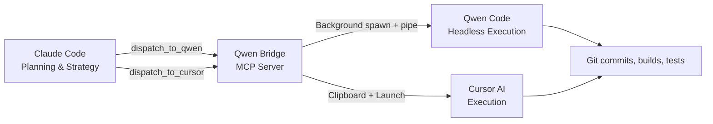

# Task: Polish Qwen Bridge v3.0 — Update User-Facing Text & GitHub README

## Context
The bridge was just upgraded to v3.0 (headless background + YOLO mode). Several text surfaces still describe the old v2.0 behavior (terminal tabs). You need to update all user-facing text to reflect v3.0 reality.

## Step 1: Update `config.json`

Change `speechText` to be more generic (supports both Qwen and Cursor):

```json
{
  "projectDir": "D:\\qwen-bridge",
  "qwenCommand": "qwen",
  "cursorCommand": "cursor",
  "terminalApp": "wt.exe",
  "notifyOnDispatch": true,
  "speechOnDispatch": true,
  "speechText": "Bridge task dispatched",
  "showTerminal": false,
  "yoloMode": true
}
```

The change: `"Qwen task dispatched"` → `"Bridge task dispatched"`

## Step 2: Update `src/index.ts` — speech for cursor dispatch

At line 317, change the hardcoded cursor speech text to use the config's `speechText` field:

Current:
```typescript
sendSpeech('Cursor task ready' + (clipboardOk ? ', content in clipboard' : ''));
```

Replace with:
```typescript
if (config.speechOnDispatch) sendSpeech(config.speechText + (clipboardOk ? ' — content in clipboard' : ''));
```

This makes the cursor speech consistent with the config settings, just like the qwen dispatch does.

## Step 3: Rewrite `README.md` to reflect v3.0 behavior

Replace the ENTIRE README.md content with this polished v3.0 version:

```markdown
# Qwen Bridge

> Seamlessly connect Claude Code to external coding agents. Plan with Claude, execute with Qwen Code or Cursor — save tokens, ship faster.

[](https://modelcontextprotocol.io)
[](https://www.typescriptlang.org)
[](https://nodejs.org)
[](LICENSE)
[](https://github.com/zhewenzhang/qwen-bridge)

---

## What is Qwen Bridge?

Qwen Bridge is an **MCP (Model Context Protocol) Server** that gives Claude Code the ability to dispatch coding tasks to external AI coding agents — **Qwen Code** and **Cursor AI**.

Claude handles strategy and planning. The bridge fires off execution tasks silently in the background. Each tool uses its own token pool, so Claude stays lean while heavy lifting happens elsewhere.

| Tool | What it does |
|------|-------------|
| `dispatch_to_qwen` | Pipes a task file to Qwen Code running headless in the background with YOLO (auto-approve) mode. Zero interaction needed. |
| `dispatch_to_cursor` | Copies task content to clipboard so you can paste it into Cursor AI chat. Optionally launches Cursor. |
| `qwen_bridge_status` | Prints current config and confirms the bridge is alive. |

**The workflow**: Claude plans the architecture, writes detailed task files (`QWEN_*.md` / `CURSOR_*.md`), then dispatches them. Qwen Code executes silently in the background, or Cursor picks up the clipboard content. **Claude tokens stay free for planning.**



## Why This Exists

Claude Code excels at **planning** — architecture, code review, debugging strategy. But large implementations burn tokens fast. Qwen Code and Cursor have their own token pools. This bridge lets you:

1. **Plan strategically in Claude** (low token usage)
2. **Execute in Qwen/Cursor** (uses their tokens, not Claude's)
3. **Zero manual copy-paste** — the bridge handles dispatch, notifications, clipboard, and background execution
4. **YOLO mode by default** — Qwen Code auto-approves all actions, no confirmation prompts

## Installation

```bash
git clone https://github.com/zhewenzhang/qwen-bridge.git
cd qwen-bridge
npm install
npm run build
```

## Configuration

Edit `config.json`:

```json
{
  "projectDir": "D:\\your-project",
  "qwenCommand": "qwen",
  "cursorCommand": "cursor",
  "terminalApp": "wt.exe",
  "notifyOnDispatch": true,
  "speechOnDispatch": true,
  "speechText": "Bridge task dispatched",
  "showTerminal": false,
  "yoloMode": true
}
```

| Field | Default | Description |
|-------|---------|-------------|
| `projectDir` | — | Project working directory — task file paths are relative to this |
| `qwenCommand` | `qwen` | CLI command for Qwen Code |
| `cursorCommand` | `cursor` | CLI command for Cursor |
| `terminalApp` | `wt.exe` | Terminal emulator (only used when `showTerminal` is on) |
| `notifyOnDispatch` | `true` | Show a Windows toast notification on dispatch |
| `speechOnDispatch` | `true` | Play a voice alert on dispatch |
| `speechText` | `"Bridge task dispatched"` | The phrase spoken aloud |
| `showTerminal` | `false` | **New in v3.0** — Set to `true` to open a visible Windows Terminal tab instead of running headless |
| `yoloMode` | `true` | **New in v3.0** — Auto-approve all Qwen Code actions (no confirmation prompts) |

## Register with Claude Code

Add this to your Claude Code settings (`~/.claude/settings.json` or project `.claude/settings.json`):

```json
{
  "mcpServers": {
    "qwen-bridge": {
      "command": "node",
      "args": ["D:\\qwen-bridge\\dist\\index.js"],
      "env": {}
    }
  }
}
```

Restart Claude Code, and the bridge tools become available automatically.

## Usage

### 1. Dispatch to Qwen Code (Background)

Ask Claude to write a task file and dispatch it:

```
Claude: Write QWEN_IMPLEMENT_AUTH.md with full implementation steps
Claude: Then dispatch_to_qwen("QWEN_IMPLEMENT_AUTH.md", "Implement OAuth login flow")
```

What happens (v3.0 headless mode):
- Windows notification pops up: *"Qwen Bridge — Implement OAuth login flow"*
- Voice alert plays: *"Bridge task dispatched"*
- Qwen Code spawns **silently in the background** with YOLO mode (auto-approve)
- Output is written to `QWEN_IMPLEMENT_AUTH_result.log` beside the task file
- Claude is **free immediately** — continue planning while Qwen executes

To watch execution in a visible terminal, set `showTerminal: true` in config.

### 2. Dispatch to Cursor

```
Claude: Write CURSOR_REFACTOR.md and call dispatch_to_cursor("CURSOR_REFACTOR.md", "Refactor database layer")
```

What happens:
- Task content is **copied to your clipboard**
- Cursor launches in your project directory (if available)
- Windows notification + voice alert fire
- Open Cursor AI chat (`Ctrl+Shift+J`), paste (`Ctrl+V`), done

### 3. Check Bridge Status

```
Claude: Check if the bridge is running
```

Claude calls `qwen_bridge_status` and reports back the config and available tools.

## How the Dispatch Works (Under the Hood)

### Qwen Code (v3.0 headless)

```
1. Claude calls dispatch_to_qwen("task.md")
        │
2. Bridge validates the file exists
        │
3. Sends Windows toast notification + speech alert
        │
4. Reads task file content, spawns: qwen -y --output-format text
        │
5. Pipes task content to qwen's stdin, captures stdout/stderr to task_result.log
        │
6. Bridge returns "✅ Dispatched" to Claude immediately
        │
7. Claude is free. Qwen Code runs headless in the background with YOLO auto-approval.
```

### Cursor

```
1. Claude calls dispatch_to_cursor("task.md")
        │
2. Bridge reads task content → copies to Windows clipboard
        │
3. Sends notification + speech alert
        │
4. Optionally opens Cursor and a terminal banner (if showTerminal is on)
        │
5. Bridge returns "✅ Dispatched" to Claude immediately
        │
6. User pastes (Ctrl+V) into Cursor AI chat → Cursor executes
```

## Project Structure

```
qwen-bridge/
├── src/
│   └── index.ts          # MCP Server main program
├── dist/
│   └── index.js          # Compiled output
├── config.json           # Your configuration
├── package.json
├── tsconfig.json
└── README.md
```

## Tech Stack

- **Runtime**: Node.js 20+
- **Language**: TypeScript 5.x (compiled to ESM)
- **Protocol**: [Model Context Protocol (MCP)](https://modelcontextprotocol.io)
- **Platform**: Windows (PowerShell, Windows Terminal)
- **Notifications**: Native Windows Toast + System.Speech TTS
- **Execution**: Background spawn with stdin pipe + file descriptor capture

## Development

```bash
# Install dependencies
npm install

# Build
npm run build

# Run locally (for testing)
npm run dev

# Test the MCP server manually:
echo '{"jsonrpc":"2.0","method":"tools/list","id":1}' | node dist/index.js
```

## Author

Created by [@zhewenzhang](https://github.com/zhewenzhang)

## License

MIT
```

Make sure to REPLACE the entire file, not append. The old README is ~194 lines; the new one should completely replace it.

## Step 4: Rebuild TypeScript

```bash
cd D:\qwen-bridge
npx tsc
```

## Step 5: Commit and Push

```bash
cd D:\qwen-bridge
git add -A
git commit -m "v3.0 polish: update README, speech text, and user-facing messages for headless + YOLO mode"
git push origin main
```

## Step 6: Verify

After pushing, verify by checking `git log --oneline -1` to confirm the commit exists.
