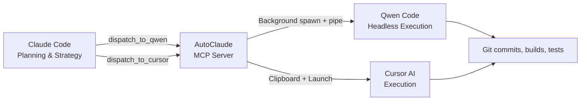

# AutoClaude

> Plan with Claude. Execute Everywhere. — The MCP bridge that connects Claude Code to Qwen Code & Cursor.

🌐 **[Landing Page](https://zhewenzhang.github.io/AutoClaude/)** · 📖 [中文说明](README_CN.md)

📋 [Changelog](CHANGELOG.md) | 📊 [Session Report](SESSION_REPORT.md)

[](https://modelcontextprotocol.io)
[](https://www.typescriptlang.org)
[](https://nodejs.org)
[](LICENSE)
[](https://github.com/zhewenzhang/AutoClaude)

---

## What is AutoClaude?

AutoClaude is an **MCP (Model Context Protocol) Server** that gives Claude Code the ability to dispatch coding tasks to external AI coding agents — **Qwen Code** and **Cursor AI**.

Claude handles strategy and planning. AutoClaude fires off execution tasks silently in the background. Each tool uses its own token pool, so Claude stays lean while heavy lifting happens elsewhere.

| Tool | Type | Description |
|------|------|-------------|
| `dispatch_task` | **Unified** | Dispatch to the currently active agent |
| `dispatch_to_qwen` | Legacy | Dispatch specifically to Qwen Code |
| `dispatch_to_cursor` | Legacy | Copy task to clipboard for Cursor |
| `list_agents` | Agent Mgmt | List all available agents + status |
| `switch_agent` | Agent Mgmt | Switch the active agent |
| `add_custom_agent` | Agent Mgmt | Register a custom CLI tool |
| `get_task_report` | Reports | Read standardized execution report |
| `get_savings_report` | Reports | View cumulative token & cost savings |
| `qwen_bridge_status` | System | Check bridge status + config |

**The workflow**: Claude plans the architecture, writes detailed task files (`QWEN_*.md` / `CURSOR_*.md`), then dispatches them. Qwen Code executes silently in the background, or Cursor picks up the clipboard content. **Claude tokens stay free for planning.**

## Project Discipline

AutoClaude enforces a strict **Planner-Executor separation** via `CLAUDE.md`:

| Role | System | Allowed Actions |
|------|--------|----------------|
| **Planner** | Claude Code | Read files, design architecture, write task files (QWEN_*.md), dispatch, verify |
| **Executor** | AI Agent (Qwen Code, etc.) | File edits, git commits, builds, deployments — all execution |

> Claude Code reads `CLAUDE.md` on startup and follows these rules automatically. Even one-line fixes go through the agent.

## Multi-Agent Support (v5.0)

AutoClaude supports any terminal-invocable AI coding CLI. Choose the tool that matches your subscription and token plan.

### Built-in Agents

| Agent | Command | Type | YOLO Flag | Install |
|-------|---------|------|-----------|---------|
| **Qwen Code** | `qwen` | CLI | `-y` | `npm i -g @qwen-code/qwen-code` |
| **Gemini CLI** | `gemini` | CLI | `--yolo` | `npm i -g @google/gemini-cli` |
| **Codex CLI** | `codex` | CLI | `--approval-mode yolo` | `npm i -g @openai/codex` |
| **Aider** | `aider` | CLI | `--yes` | `pip install aider-chat` |
| **OpenCode** | `opencode` | CLI | `-y` | `npm i -g @opencode-ai/cli` |
| **Cline CLI** | `cline` | CLI | `-y` | `npm i -g @cline/cli` |
| **Cursor AI** | `cursor` | Clipboard | — | [cursor.com](https://cursor.com) |

### Switching Agents

```
Claude: list_agents → see what's available
User: "I want to use Gemini CLI"
Claude: switch_agent("gemini")
Claude: dispatch_task("MY_TASK.md", "Build feature X")
→ AutoClaude pipes task to gemini --yolo in the background
```

### Adding Custom Agents

```
Claude: add_custom_agent("my-tool", "My Agent", "my-ai", "-y", "--text")
```

Don't see your tool? Use `add_custom_agent` to register any CLI tool.



## Why This Exists

Claude Code excels at **planning** — architecture, code review, debugging strategy. But large implementations burn tokens fast. AutoClaude's multi-agent system lets you dispatch to **any AI coding CLI** — Qwen Code, Gemini CLI, Codex, Aider, and more — each with its own token pool. AutoClaude lets you:

1. **Plan strategically in Claude** (low token usage)
2. **Execute in any agent** (uses their tokens, not Claude's)
3. **Zero manual copy-paste** — AutoClaude handles dispatch, notifications, clipboard, and background execution
4. **YOLO mode by default** — agents auto-approve all actions, no confirmation prompts
5. **Switch agents on the fly** — pick the right tool for each task's needs and your subscription plan

### 💰 Token Savings

Every task is automatically tracked. Use `get_savings_report` in Claude to see your cumulative savings.

| Metric | Per Task (Average) |
|--------|-------------------|
| Claude tokens (planning) | ~7,000 |
| Equivalent full-Claude | ~25,000 |
| **Tokens saved** | **~18,000 (72%)** |
| **Cost saved** | **~$0.30 (Opus 4.7)** |

> See [SESSION_REPORT.md](SESSION_REPORT.md) for a real example — 13 tasks, 67% token savings, $3.10 saved in one session.

> At 100 tasks/month: **$30/month saved**. At 1,000 tasks/month: **$300/month saved**.

## Installation

### Quick Install (NPM)

```bash
npm install -g autoclaude
```

### From GitHub

```bash
git clone https://github.com/zhewenzhang/AutoClaude.git
cd AutoClaude
npm install && npm run build
```

### Configure MCP in Claude Code

Add this to your Claude Code settings (`~/.claude/settings.json` or project `.claude/settings.json`):

```json
{
  "mcpServers": {
    "autoclaude": {
      "command": "node",
      "args": ["<path-to-AutoClaude>\\dist\\index.js"],
      "env": {}
    }
  }
}
```

Restart Claude Code, and the bridge tools become available automatically.

## Usage

### 1. Dispatch to Qwen Code (Background)

Ask Claude to write a task file and dispatch it:

```
Claude: Write QWEN_IMPLEMENT_AUTH.md with full implementation steps
Claude: Then dispatch_to_qwen("QWEN_IMPLEMENT_AUTH.md", "Implement OAuth login flow")
```

What happens (v4.0 headless mode):
- Windows notification pops up: *"AutoClaude — Implement OAuth login flow"*
- Voice alert plays: *"AutoClaude task dispatched"*
- Qwen Code spawns **silently in the background** with YOLO mode (auto-approve)
- Output is written to `QWEN_IMPLEMENT_AUTH_result.log` beside the task file
- Claude is **free immediately** — continue planning while Qwen executes

To watch execution in a visible terminal, set `showTerminal: true` in config.

### 2. Dispatch to Cursor

```
Claude: Write CURSOR_REFACTOR.md and call dispatch_to_cursor("CURSOR_REFACTOR.md", "Refactor database layer")
```

What happens:
- Task content is **copied to your clipboard**
- Cursor launches in your project directory (if available)
- Windows notification + voice alert fire
- Open Cursor AI chat (`Ctrl+Shift+J`), paste (`Ctrl+V`), done

### 3. Check AutoClaude Status

```
Claude: Check if AutoClaude is running
```

Claude calls `qwen_bridge_status` and reports back the config and available tools.

## Standardized Output

Every task dispatched by AutoClaude produces two files:

| File | Content |
|------|---------|
| `TASK_NAME_result.log` | Raw execution output from the agent |
| `TASK_NAME_summary.md` | Structured process report with role separation |

### Process Report Format

The `_summary.md` follows a fixed structure:

```markdown
# Task Report: <task_name>

| Field | Value |
|-------|-------|
| **Task File** | `QWEN_EXAMPLE.md` |
| **Dispatched** | 2026-05-08T14:30:00.000Z |
| **Agent** | Qwen Code |
| **Mode** | Headless background + YOLO auto-approve |

---

## Role Separation

| Role | System | Responsibility |
|------|--------|----------------|
| Planner | Claude Code | Strategy, architecture, task authoring, verification |
| Dispatcher | AutoClaude | Task validation, dispatch, notification, output capture |
| Executor | Qwen Code | File operations, git, builds, deployments |

---

## Execution Log
(Raw agent output...)

---

## Completion Status

| Metric | Value |
|--------|-------|
| **Status** | ✅ Completed |
| **Duration** | 127s |

## Completion Checklist

| Step | Role | Status |
|------|------|--------|
| Architecture planning | Claude | ✅ |
| Task file authoring | Claude | ✅ |
| Dispatch | AutoClaude | ✅ |
| git init & config | Qwen Code | ✅ |
| File creation & editing | Qwen Code | ✅ |
| Build & test | Qwen Code | ✅ |
| Commit & push | Qwen Code | ✅ |
| Verification | Claude | ✅ |
```

### Reading Reports via MCP

Claude can call `get_task_report("QWEN_EXAMPLE.md")` to read the summary without opening files manually. Use `qwen_bridge_status` to confirm the bridge is running.

## Terminal Output (v5.2)

All bridge responses use Unicode box-drawing and emoji for clarity:

```
┌─────────────────────────────────────────────────────┐
│              AutoClaude v5.2 — Status               │
├─────────────────────────────────────────────────────┤
│  Active Agent : Qwen Code                           │
│  YOLO Mode    : ✅ ON                               │
│  Terminal     : headless background                │
├─────────────────────────────────────────────────────┤
│  Agents       : 1 enabled / 7 total                │
│  💰 Savings   : 0 tasks · 0 tokens · $0.00         │
└─────────────────────────────────────────────────────┘
```

## How Dispatch Works (Under the Hood)

### Qwen Code (v5.2 headless background)

```
1. Claude calls dispatch_task("task.md") or dispatch_to_qwen("task.md")
        │
2. AutoClaude validates the file exists
        │
3. Sends Windows toast notification + speech alert
        │
4. Spawns the active agent headlessly in the background with YOLO auto-approve
        │
5. Pipes task file content as a batch to the agent's stdin
   Captures stdout/stderr to TASK_NAME_result.log
        │
6. AutoClaude returns "✅ Dispatched" to Claude immediately
        │
7. Claude is free. The agent runs headless in the background with YOLO auto-approval.
   Output is written to TASK_NAME_result.log and a structured TASK_NAME_summary.md.
```

### Cursor

```
1. Claude calls dispatch_to_cursor("task.md")
        │
2. AutoClaude reads task content → copies to Windows clipboard
        │
3. Sends notification + speech alert
        │
4. Optionally opens Cursor and a terminal banner (if showTerminal is on)
        │
5. AutoClaude returns "✅ Dispatched" to Claude immediately
        │
6. User pastes (Ctrl+V) into Cursor AI chat → Cursor executes
```

## Project Structure

```
AutoClaude/
├── src/
│   └── index.ts          # AutoClaude MCP Server main program
├── dist/
│   └── index.js          # Compiled output
├── config.json           # Your configuration
├── package.json
├── tsconfig.json
├── index.html            # Landing page (GitHub Pages)
├── README.md             # English documentation
├── README_CN.md          # Chinese documentation
└── .autoclaude_savings.json  # Cumulative token savings tracking
```

## Tech Stack

- **Runtime**: Node.js 20+
- **Language**: TypeScript 5.x (compiled to ESM)
- **Protocol**: [Model Context Protocol (MCP)](https://modelcontextprotocol.io)
- **Platform**: Windows (PowerShell, Windows Terminal)
- **Notifications**: Native Windows Toast + System.Speech TTS
- **Execution**: Background spawn with stdin pipe + file descriptor capture

## Development

```bash
# Install dependencies
npm install

# Build
npm run build

# Run locally (for testing)
npm run dev

# Test the MCP server manually:
echo '{"jsonrpc":"2.0","method":"tools/list","id":1}' | node dist/index.js
```

## Author

Created by [ @zhewenzhang](https://github.com/zhewenzhang)

## Contributing

This project follows a strict **Planner-Executor workflow**. See [CLAUDE.md](CLAUDE.md) for the AI agent rules. Contributions are dispatched through the bridge — not committed directly.

## License

MIT
