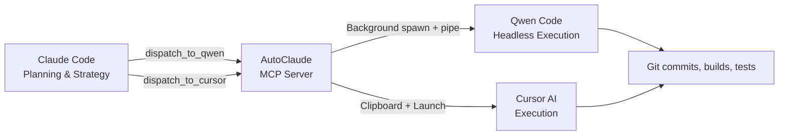

# AutoClaude

> Plan with Claude. Execute Everywhere. — The MCP bridge that connects Claude Code to Qwen Code & Cursor.

🌐 **[Landing Page](https://zhewenzhang.github.io/qwen-bridge/)**

[](https://modelcontextprotocol.io)
[](https://www.typescriptlang.org)
[](https://nodejs.org)
[](LICENSE)
[](https://github.com/zhewenzhang/qwen-bridge)

---

## What is AutoClaude?

AutoClaude is an **MCP (Model Context Protocol) Server** that gives Claude Code the ability to dispatch coding tasks to external AI coding agents — **Qwen Code** and **Cursor AI**.

Claude handles strategy and planning. AutoClaude fires off execution tasks silently in the background. Each tool uses its own token pool, so Claude stays lean while heavy lifting happens elsewhere.

| Tool | What it does |
|------|-------------|
| `dispatch_to_qwen` | Pipes a task file to Qwen Code running headless in the background with YOLO (auto-approve) mode. Zero interaction needed. |
| `dispatch_to_cursor` | Copies task content to clipboard so you can paste it into Cursor AI chat. Optionally launches Cursor. |
| `qwen_bridge_status` | Prints current config and confirms AutoClaude is alive. |

**The workflow**: Claude plans the architecture, writes detailed task files (`QWEN_*.md` / `CURSOR_*.md`), then dispatches them. Qwen Code executes silently in the background, or Cursor picks up the clipboard content. **Claude tokens stay free for planning.**



## Why This Exists

Claude Code excels at **planning** — architecture, code review, debugging strategy. But large implementations burn tokens fast. Qwen Code and Cursor have their own token pools. AutoClaude lets you:

1. **Plan strategically in Claude** (low token usage)
2. **Execute in Qwen/Cursor** (uses their tokens, not Claude's)
3. **Zero manual copy-paste** — AutoClaude handles dispatch, notifications, clipboard, and background execution
4. **YOLO mode by default** — Qwen Code auto-approves all actions, no confirmation prompts

## Installation

```bash
git clone https://github.com/zhewenzhang/qwen-bridge.git
cd qwen-bridge
npm install
npm run build
```

## Configuration

Edit `config.json`:

```json
{
  "projectDir": "D:\\your-project",
  "qwenCommand": "qwen",
  "cursorCommand": "cursor",
  "terminalApp": "wt.exe",
  "notifyOnDispatch": true,
  "speechOnDispatch": true,
  "speechText": "AutoClaude task dispatched",
  "showTerminal": false,
  "yoloMode": true
}
```

| Field | Default | Description |
|-------|---------|-------------|
| `projectDir` | — | Project working directory — task file paths are relative to this |
| `qwenCommand` | `qwen` | CLI command for Qwen Code |
| `cursorCommand` | `cursor` | CLI command for Cursor |
| `terminalApp` | `wt.exe` | Terminal emulator (only used when `showTerminal` is on) |
| `notifyOnDispatch` | `true` | Show a Windows toast notification on dispatch |
| `speechOnDispatch` | `true` | Play a voice alert on dispatch |
| `speechText` | `"AutoClaude task dispatched"` | The phrase spoken aloud |
| `showTerminal` | `false` | **New in v4.0** — Set to `true` to open a visible Windows Terminal tab instead of running headless |
| `yoloMode` | `true` | **New in v4.0** — Auto-approve all Qwen Code actions (no confirmation prompts) |

## Register with Claude Code

Add this to your Claude Code settings (`~/.claude/settings.json` or project `.claude/settings.json`):

```json
{
  "mcpServers": {
    "autoclaude": {
      "command": "node",
      "args": ["D:\\qwen-bridge\\dist\\index.js"],
      "env": {}
    }
  }
}
```

Restart Claude Code, and the bridge tools become available automatically.

## Usage

### 1. Dispatch to Qwen Code (Background)

Ask Claude to write a task file and dispatch it:

```
Claude: Write QWEN_IMPLEMENT_AUTH.md with full implementation steps
Claude: Then dispatch_to_qwen("QWEN_IMPLEMENT_AUTH.md", "Implement OAuth login flow")
```

What happens (v4.0 headless mode):
- Windows notification pops up: *"AutoClaude — Implement OAuth login flow"*
- Voice alert plays: *"AutoClaude task dispatched"*
- Qwen Code spawns **silently in the background** with YOLO mode (auto-approve)
- Output is written to `QWEN_IMPLEMENT_AUTH_result.log` beside the task file
- Claude is **free immediately** — continue planning while Qwen executes

To watch execution in a visible terminal, set `showTerminal: true` in config.

### 2. Dispatch to Cursor

```
Claude: Write CURSOR_REFACTOR.md and call dispatch_to_cursor("CURSOR_REFACTOR.md", "Refactor database layer")
```

What happens:
- Task content is **copied to your clipboard**
- Cursor launches in your project directory (if available)
- Windows notification + voice alert fire
- Open Cursor AI chat (`Ctrl+Shift+J`), paste (`Ctrl+V`), done

### 3. Check AutoClaude Status

```
Claude: Check if AutoClaude is running
```

Claude calls `qwen_bridge_status` and reports back the config and available tools.

## Standardized Output

Every task dispatched by AutoClaude produces two files:

| File | Content |
|------|---------|
| `TASK_NAME_result.log` | Raw execution output from the agent |
| `TASK_NAME_summary.md` | Structured process report with role separation |

### Process Report Format

The `_summary.md` follows a fixed structure:

```markdown
# Task Report: <task_name>

| Field | Value |
|-------|-------|
| **Task File** | `QWEN_EXAMPLE.md` |
| **Dispatched** | 2026-05-08T14:30:00.000Z |
| **Agent** | Qwen Code |
| **Mode** | Headless background + YOLO auto-approve |

---

## Role Separation

| Role | System | Responsibility |
|------|--------|----------------|
| Planner | Claude Code | Strategy, architecture, task authoring, verification |
| Dispatcher | AutoClaude | Task validation, dispatch, notification, output capture |
| Executor | Qwen Code | File operations, git, builds, deployments |

---

## Execution Log
(Raw agent output...)

---

## Completion Status

| Metric | Value |
|--------|-------|
| **Status** | ✅ Completed |
| **Duration** | 127s |

## Completion Checklist

| Step | Role | Status |
|------|------|--------|
| Architecture planning | Claude | ✅ |
| Task file authoring | Claude | ✅ |
| Dispatch | AutoClaude | ✅ |
| git init & config | Qwen Code | ✅ |
| File creation & editing | Qwen Code | ✅ |
| Build & test | Qwen Code | ✅ |
| Commit & push | Qwen Code | ✅ |
| Verification | Claude | ✅ |
```

### Reading Reports via MCP

Claude can call `get_task_report("QWEN_EXAMPLE.md")` to read the summary without opening files manually. Use `qwen_bridge_status` to confirm the bridge is running.

## How the Dispatch Works (Under the Hood)

### Qwen Code (v4.0 headless)

```
1. Claude calls dispatch_to_qwen("task.md")
        │
2. AutoClaude validates the file exists
        │
3. Sends Windows toast notification + speech alert
        │
4. Reads task file content, spawns: qwen -y --output-format text
        │
5. Pipes task content to qwen's stdin, captures stdout/stderr to task_result.log
        │
6. AutoClaude returns "✅ Dispatched" to Claude immediately
        │
7. Claude is free. Qwen Code runs headless in the background with YOLO auto-approval.
```

### Cursor

```
1. Claude calls dispatch_to_cursor("task.md")
        │
2. AutoClaude reads task content → copies to Windows clipboard
        │
3. Sends notification + speech alert
        │
4. Optionally opens Cursor and a terminal banner (if showTerminal is on)
        │
5. AutoClaude returns "✅ Dispatched" to Claude immediately
        │
6. User pastes (Ctrl+V) into Cursor AI chat → Cursor executes
```

## Project Structure

```
qwen-bridge/
├── src/
│   └── index.ts          # AutoClaude MCP Server main program
├── dist/
│   └── index.js          # Compiled output
├── config.json           # Your configuration
├── package.json
├── tsconfig.json
├── index.html            # Landing page (GitHub Pages)
└── README.md
```

## Tech Stack

- **Runtime**: Node.js 20+
- **Language**: TypeScript 5.x (compiled to ESM)
- **Protocol**: [Model Context Protocol (MCP)](https://modelcontextprotocol.io)
- **Platform**: Windows (PowerShell, Windows Terminal)
- **Notifications**: Native Windows Toast + System.Speech TTS
- **Execution**: Background spawn with stdin pipe + file descriptor capture

## Development

```bash
# Install dependencies
npm install

# Build
npm run build

# Run locally (for testing)
npm run dev

# Test the MCP server manually:
echo '{"jsonrpc":"2.0","method":"tools/list","id":1}' | node dist/index.js
```

## Author

Created by [ @zhewenzhang](https://github.com/zhewenzhang)

## License

MIT
