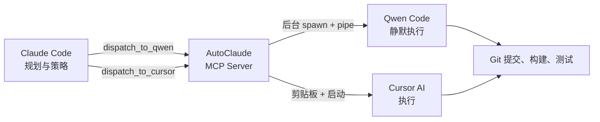

# AutoClaude

> Claude 做规划。Qwen 做执行。Token 零浪费。

[](https://modelcontextprotocol.io)
[](https://www.typescriptlang.org)
[](https://nodejs.org)
[](LICENSE)
[](https://github.com/zhewenzhang/AutoClaude)

📋 [更新日志](CHANGELOG.md) | 📊 [会话报告](SESSION_REPORT.md)

---

## 这是什么？

AutoClaude 是一个 **MCP (Model Context Protocol) Server**，让 Claude Code 能够将编程任务派发给外部 AI 编码代理 —— 支持 **Qwen Code、Gemini CLI、Codex CLI、Aider、OpenCode、Cline CLI、Cursor AI** 等多种工具。

Claude 负责战略和规划。AutoClaude 在后台静默派发任务。每个工具使用自己的 Token 池，Claude 保持轻量，繁重工作由其他模型完成。支持多 Agent 切换和自定义 CLI 注册。

| 工具 | 类型 | 功能 |
|------|------|------|
| `dispatch_task` | **统一** | 派发任务到当前活跃的 AI 编码代理 |
| `dispatch_to_qwen` | 遗留 | 专门派发给 Qwen Code |
| `dispatch_to_cursor` | 遗留 | 复制任务到剪贴板供 Cursor 使用 |
| `list_agents` | 代理管理 | 列出所有可用的代理及状态 |
| `switch_agent` | 代理管理 | 切换活跃的 AI 编码代理 |
| `add_custom_agent` | 代理管理 | 注册自定义 CLI 工具 |
| `get_task_report` | 报告 | 读取标准化执行报告 |
| `get_savings_report` | 报告 | 查看累计 Token 和成本节省 |
| `qwen_bridge_status` | 系统 | 检查桥接状态和配置 |

## 多 Agent 支持（v5.0）

AutoClaude 支持任何可通过终端调用的 AI 编码 CLI。选择适合你的订阅和 Token 计划的工具。

### 内置 Agent

| Agent | 命令 | 类型 | YOLO 标志 | 安装 |
|-------|------|------|-----------|------|
| **Qwen Code** | `qwen` | CLI | `-y` | `npm i -g @qwen-code/qwen-code` |
| **Gemini CLI** | `gemini` | CLI | `--yolo` | `npm i -g @google/gemini-cli` |
| **Codex CLI** | `codex` | CLI | `--approval-mode yolo` | `npm i -g @openai/codex` |
| **Aider** | `aider` | CLI | `--yes` | `pip install aider-chat` |
| **OpenCode** | `opencode` | CLI | `-y` | `npm i -g @opencode-ai/cli` |
| **Cline CLI** | `cline` | CLI | `-y` | `npm i -g @cline/cli` |
| **Cursor AI** | `cursor` | 剪贴板 | — | [cursor.com](https://cursor.com) |

### 切换 Agent

```
Claude: list_agents → 查看可用代理
用户: "我想用 Gemini CLI"
Claude: switch_agent("gemini")
Claude: dispatch_task("MY_TASK.md", "构建功能 X")
→ AutoClaude 在后台将任务通过管道传给 gemini --yolo
```

### 添加自定义 Agent

```
Claude: add_custom_agent("my-tool", "我的工具", "my-ai", "-y", "--text")
```

找不到你的工具？使用 `add_custom_agent` 注册任何 CLI 工具。

## 项目纪律

AutoClaude 通过 `CLAUDE.md` 强制执行严格的**规划-执行分离**：

| 角色 | 系统 | 允许的操作 |
|------|------|-----------|
| **规划者** | Claude Code | 读取文件、设计架构、编写任务文件 (QWEN_*.md)、派发、验证 |
| **执行者** | AI Agent (Qwen Code 等) | 文件编辑、git 提交、构建、部署 — 所有执行操作 |

> Claude Code 启动时自动读取 `CLAUDE.md` 并遵守规则。即使是一行代码的修改也要通过代理完成。

**工作流程**：Claude 设计架构，编写详细任务文件（`QWEN_*.md` / `CURSOR_*.md`），然后派发。Qwen Code 在后台静默执行，或 Cursor 通过剪贴板接收任务。**Claude Token 只用于规划，执行零消耗。**



## 为什么需要 AutoClaude？

Claude Code 擅长**规划**——架构设计、代码审查、调试策略。但大规模实现会快速消耗 Token。Qwen Code 和 Cursor 有自己的 Token 池。通过 AutoClaude：

1. **Claude 做战略规划**（Token 消耗极低）
2. **Qwen/Cursor 做执行**（使用各自的 Token，不占用 Claude）
3. **零手动复制粘贴** —— 桥接层自动处理派发、通知、剪贴板、后台执行
4. **YOLO 模式默认开启** —— Qwen Code 自动批准所有操作，无需确认

### 💰 Token 节省效果

每次任务派发，AutoClaude 自动计算并记录 Token 节省：

- **Claude 规划阶段**：~4K-8K tokens（读文件 + 写任务）
- **Qwen Code 执行阶段**：~15K-30K tokens（如果交给 Claude 做需要这么多）
- **每次任务节省**：~60-80% 的 Claude Token
- **按 Opus 4.7 定价**：每次任务节省约 $0.15-$0.65

使用 `get_savings_report` 查看累计节省金额。

> 参见 [SESSION_REPORT.md](SESSION_REPORT.md) 实际案例 — 13 次任务，67% Token 节省，节省 $3.10。

## 安装

### 快速安装 (NPM)

```bash
npm install -g autoclaude
```

### 从 GitHub 安装

```bash
git clone https://github.com/zhewenzhang/AutoClaude.git
cd AutoClaude
npm install && npm run build
```

## 配置

编辑 `config.json`。完整的多代理配置见 [config.json](config.json)：

```json
{
  "projectDir": "D:\\your-project",
  "qwenCommand": "qwen",
  "cursorCommand": "cursor",
  "activeAgent": "qwen",
  "agents": {
    "qwen": { "command": "qwen", "yoloFlag": "-y", "type": "cli" },
    "gemini": { "command": "gemini", "yoloFlag": "--yolo", "type": "cli" },
    "codex": { "command": "codex", "yoloFlag": "--approval-mode yolo", "type": "cli" },
    "cursor": { "command": "cursor", "type": "clipboard" }
  },
  "terminalApp": "wt.exe",
  "notifyOnDispatch": true,
  "speechOnDispatch": true,
  "speechText": "AutoClaude task dispatched",
  "showTerminal": false,
  "yoloMode": true
}
```

| 字段 | 默认值 | 说明 |
|------|--------|------|
| `projectDir` | — | 项目工作目录，任务文件路径相对于此 |
| `qwenCommand` | `qwen` | Qwen Code CLI 命令 |
| `cursorCommand` | `cursor` | Cursor CLI 命令 |
| `terminalApp` | `wt.exe` | 终端应用（仅 `showTerminal` 为 true 时使用） |
| `notifyOnDispatch` | `true` | 派发时弹出 Windows Toast 通知 |
| `speechOnDispatch` | `true` | 派发时播放语音提醒 |
| `speechText` | `"AutoClaude task dispatched"` | 语音播报内容 |
| `showTerminal` | `false` | 设为 true 可在可见终端窗口中查看执行过程 |
| `yoloMode` | `true` | 自动批准所有 Qwen Code 操作（无需确认） |

## 注册到 Claude Code

在 Claude Code 设置中（`~/.claude/settings.json` 或项目 `.claude/settings.json`）：

```json
{
  "mcpServers": {
    "autoclaude": {
      "command": "node",
      "args": ["D:\\AutoClaude\\dist\\index.js"],
      "env": {}
    }
  }
}
```

重启 Claude Code，桥接工具自动可用。

## 使用方式

### 1. 派发任务给 Qwen Code（后台静默）

让 Claude 写任务文件并派发：

```
Claude: 写 QWEN_IMPLEMENT_AUTH.md，包含完整实现步骤
Claude: 然后 dispatch_to_qwen("QWEN_IMPLEMENT_AUTH.md", "实现 OAuth 登录流程")
```

执行过程（v4.2 静默模式）：
- Windows 通知弹出：*"AutoClaude — 实现 OAuth 登录流程"*
- 语音播报：*"AutoClaude task dispatched"*
- Qwen Code **在后台静默启动**，YOLO 全自动模式
- 输出写入 `QWEN_IMPLEMENT_AUTH_result.log`
- 自动生成 `QWEN_IMPLEMENT_AUTH_summary.md`（含 Token 节省报告）
- **Claude 立即释放** —— 继续规划下一个任务

### 2. 派发任务给 Cursor

```
Claude: 写 CURSOR_REFACTOR.md 并 dispatch_to_cursor("CURSOR_REFACTOR.md", "重构数据库层")
```

执行过程：
- 任务内容**复制到剪贴板**
- Cursor 在项目目录中启动（如可用）
- Windows 通知 + 语音提醒
- 打开 Cursor AI Chat（`Ctrl+Shift+J`），粘贴（`Ctrl+V`），完成

### 3. 查看任务报告

```
Claude: 查看上次任务的执行报告
```

Claude 调用 `get_task_report("QWEN_IMPLEMENT_AUTH.md")`，返回标准化的执行报告。

### 4. 查看节省金额

```
Claude: 我节省了多少 Token？
```

Claude 调用 `get_savings_report`，展示累计节省的 Token 和金额。

## 标准化输出

每次任务派发产生两个文件：

| 文件 | 内容 |
|------|------|
| `TASK_NAME_result.log` | Agent 的原始执行输出 |
| `TASK_NAME_summary.md` | **结构化报告** — 包含角色分工、完成清单 |

### 报告格式示例

```markdown
# Task Report: QWEN_GITHUB_SETUP

## Role Separation
| Role | System | Responsibility |
|------|--------|----------------|
| Planner | Claude Code | 策略、架构、验证 |
| Dispatcher | AutoClaude | 派发、通知、成本追踪 |
| Executor | Qwen Code | 文件操作、Git、构建 |

## Token Economics
| 指标 | 数值 |
|------|------|
| **Claude 消耗** | ~7,000 tokens |
| **等效全 Claude 执行** | ~25,000 tokens |
| **Token 节省** | **~18,000 tokens** |
| **成本节省** | **$0.32** |

## 完成状态
| 状态 | ✅ 已完成 |
| 耗时 | 127s |
```

## 终端输出（v5.2）

所有桥接响应使用 Unicode 框线和表情符号以保持清晰：

```
┌─────────────────────────────────────────────────────┐
│              AutoClaude v5.2 — 状态                  │
├─────────────────────────────────────────────────────┤
│  活跃代理     : Qwen Code                           │
│  YOLO 模式    : ✅ 开启                              │
│  终端         : 后台静默                             │
├─────────────────────────────────────────────────────┤
│  代理         : 1 已启用 / 7 总计                    │
│  💰 节省      : 0 任务 · 0 tokens · $0.00           │
└─────────────────────────────────────────────────────┘
```

## 技术栈

- **运行时**：Node.js 20+
- **语言**：TypeScript 5.x（编译为 ESM）
- **协议**：[Model Context Protocol (MCP)](https://modelcontextprotocol.io)
- **平台**：Windows（PowerShell、Windows Terminal）
- **通知**：Windows Toast 原生通知 + System.Speech TTS
- **执行**：后台 spawn + stdin pipe + fd 输出捕获

## 开发

```bash
npm install        # 安装依赖
npm run build      # 编译
npm run dev        # 本地运行（测试用）

# 手动测试 MCP Server：
echo '{"jsonrpc":"2.0","method":"tools/list","id":1}' | node dist/index.js
```

## 作者

Created by [ @zhewenzhang](https://github.com/zhewenzhang)

## 贡献

本项目遵循严格的**规划-执行工作流**。有关 AI 代理规则，请参阅 [CLAUDE.md](CLAUDE.md)。所有贡献都通过桥接派发，不直接提交。

## 语言

- [English README](README.md)
- [中文说明](README_CN.md)

## License

MIT
